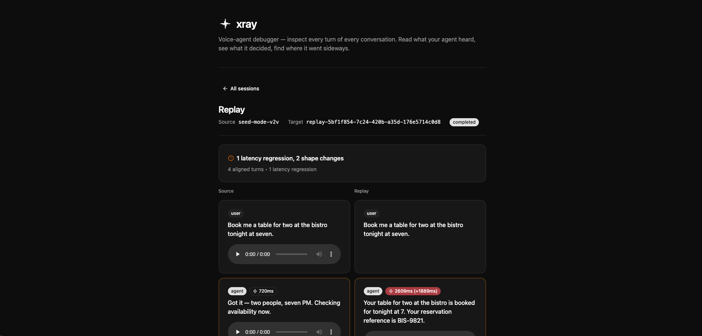

# xray


> **The only voice-agent debugger that lets you replay a broken call through your own code.**

**Status: alpha / early access.** Pre-v1, no published Docker image yet, APIs and the ingest wire format may change before v1. Build from source today (see [Install](#install)); a tagged GHCR release is the v0.1.0 milestone. If you're trying it out, please open issues — that's the most useful contribution right now.



---

## Why it exists

If you're building a custom voice loop — Pipecat, LiveKit Agents, OpenAI Realtime, Gemini Live, raw STT→LLM→TTS — you have nothing today. Print statements, scattered log files, a stopwatch in your head. Fleet observability tools were designed for text agents and treat audio, latency-per-stage, and barge-in as afterthoughts.

xray is the **single-session voice-agent debugger** built for the long tail of homegrown voice stacks.

- **Four `fetch` calls** in your loop and one `docker run` give you a structured, voice-native view of every session: turns, tool calls, latency per stage, barge-in — all first-class.
- **Take any recorded session, click Replay, and xray walks the user-side inputs through your updated agent code** via a webhook. See old behavior vs new, turn by turn, without picking up the microphone.
- **No SDK. No SaaS. No external database.** One Docker image, SQLite on a mounted volume.

Hosted-provider agents (ElevenLabs Convai, Vapi, Retell, Voiceflow) are supported through optional adapters — but the product is built for the long tail of homegrown voice stacks that have nothing else.

---

## Install

> **Heads up — early access.** No published image on GHCR yet. The publish workflow ([`.github/workflows/publish.yml`](.github/workflows/publish.yml)) is wired and fires on `v*.*.*` tag push (multi-arch, cosign keyless + build-provenance attestations), but no tag has been cut. Until v0.1.0 ships, build the image yourself — same Dockerfile, one command.

### Build it yourself (today)

```bash
git clone https://github.com/basilebong/xray.git
cd xray
docker build -t xray:local .
```

Or via the bundled pnpm scripts (these are what CI runs):

```bash
pnpm docker:build      # build the multi-stage image as xray:local
pnpm docker:smoke      # build, run, curl /healthz, kill — sanity check
```

### Once v0.1.0 ships

The image will live at `ghcr.io/basilebong/xray` on GitHub Container Registry, pulled with `docker pull ghcr.io/basilebong/xray:<tag>`. Tagged releases will be signed with cosign keyless (OIDC) and carry build-provenance attestations — verify before running with:

```bash
cosign verify ghcr.io/basilebong/xray:<tag> \
  --certificate-identity-regexp 'https://github.com/basilebong/xray/' \
  --certificate-oidc-issuer https://token.actions.githubusercontent.com
```

Watch the [packages page](https://github.com/basilebong/xray/pkgs/container/xray) — it'll populate the first time a `v*` tag lands.

## Quickstart

Operators bring API keys; nothing is baked into the image (per [`.claude/rules/public-repo.md`](.claude/rules/public-repo.md) §2). The `-v xray-data:/data` flag mounts the SQLite store so conversations survive container restarts.

```bash
# Until v0.1.0 ships, use the local build from above:
docker run --rm \
  -p 8080:8080 \
  -v xray-data:/data \
  xray:local

# Once published, this is the one-liner:
# docker run --rm -p 8080:8080 -v xray-data:/data ghcr.io/basilebong/xray:latest
```

Then open <http://localhost:8080>. The API reference (HTTP routes, text-replay webhook, realtime-replay WS protocol) is at <http://localhost:8080/docs>.

### From your custom voice loop — four `fetch` calls

Any language with an HTTP client works. Stream events as they happen; the UI updates as new turns arrive.

```js
// 1. Session starts
await fetch("http://localhost:8080/v1/sessions/sess-42/events", {
  method: "POST",
  headers: { "Content-Type": "application/json" },
  body: JSON.stringify({
    type: "session_started",
    agentId: "concierge-v2v",
    startedAt: new Date().toISOString(),
  }),
});

// 2. A user turn completes
await fetch("http://localhost:8080/v1/sessions/sess-42/events", {
  method: "POST",
  headers: { "Content-Type": "application/json" },
  body: JSON.stringify({
    type: "turn_completed",
    idx: 0,
    role: "user",
    text: "Book me a table for two at the bistro tonight at seven.",
    timestamp: new Date().toISOString(),
  }),
});

// 3. An agent turn completes — include the latency-to-first-output
await fetch("http://localhost:8080/v1/sessions/sess-42/events", {
  method: "POST",
  headers: { "Content-Type": "application/json" },
  body: JSON.stringify({
    type: "turn_completed",
    idx: 1,
    role: "agent",
    text: "Got it — two people, seven PM. Checking availability now.",
    timestamp: new Date().toISOString(),
    responseLatencyMs: 720,
  }),
});

// 4. Session ends
await fetch("http://localhost:8080/v1/sessions/sess-42/events", {
  method: "POST",
  headers: { "Content-Type": "application/json" },
  body: JSON.stringify({
    type: "session_ended",
    endedAt: new Date().toISOString(),
    durationMs: 22_000,
  }),
});
```

See [`docs/INGEST.md`](docs/INGEST.md) for the full wire contract — including voice-to-voice (OpenAI Realtime, Gemini Live), pipeline (STT→LLM→TTS), tool calls, barge-in, and per-turn audio upload.

---

## What you see

<!-- Add screenshots as the UI lands: list view, transcript+inspector, replay diff. -->

- **Conversation list** — every ingested session, source-tagged (ingest vs adapter), filterable by agent.
- **Transcript + inspector** — every turn in order, with tool calls inlined, per-turn audio playback, latency-per-stage tags, barge-in indicators.
- **Replay diff** — re-run any session through your updated webhook and see source vs replay side-by-side, turn by turn, with latency regressions and shape changes flagged.

## Replay — the differentiator

The mechanics:

1. From any recorded session, click **Replay** and paste your webhook URL.
2. xray POSTs each user turn (text + recorded tool results) to your webhook.
3. Your webhook returns the new agent text (and optionally tool calls and latency).
4. xray writes a fresh session and renders the diff against the original.

Two flavors:

- **Text replay** (`POST /v1/replays`) — your webhook is an HTTP endpoint. Fastest to wire up for STT→LLM→TTS loops.
- **Realtime (V2V) replay** (`POST /v1/replays/realtime`) — your webhook is a WebSocket server. xray streams the original user audio chunk-by-chunk; your webhook returns agent audio + transcript framed by turn boundaries. Works for OpenAI Realtime / Gemini Live / any voice-to-voice setup.

Recorded tool results are forwarded with each user turn so your replay doesn't re-execute real side effects (refunds, calendar bookings, etc.). Both protocols are fully documented at `/docs` (HTTP + webhook) and `/asyncapi.json` (realtime WS frames) on your running xray instance.

---

## vs Langfuse / Helicone / observability tools

xray is a **single-session debugger**; Langfuse and Helicone are **fleet observability**. Different jobs.

- If you're shipping text agents and want dashboards, traces, eval pipelines, and prompt analytics across thousands of conversations — use Langfuse or Helicone. They were built for that.
- If you're debugging *one specific broken call* on a voice agent — playing back the audio, inspecting tool args, finding where the latency snuck in, re-running the conversation through a fix — xray is built for that. Voice-specific surfaces (per-turn audio, barge-in, per-stage latency, V2V replay) are first-class, not afterthoughts.

Most teams running voice agents seriously will end up with both.

---

## Adapter mode (secondary)

For ElevenLabs Convai users (and other hosted providers as adapters land), xray can pull conversations directly from the provider's API instead of receiving them via ingest. Drop your API key in via `docker run -e`, point the UI at the provider, and xray syncs sessions into the same SQLite store the UI reads from.

```bash
# Until v0.1.0 ships on GHCR, swap `ghcr.io/basilebong/xray:latest` for the
# `xray:local` you built above. Replace `sk_...` with your real provider key.
docker run --rm \
  -p 8080:8080 \
  -v xray-data:/data \
  -e ELEVENLABS_API_KEY=sk_... \
  ghcr.io/basilebong/xray:latest
```

Adapters live in [`src/adapters/<provider>/`](src/adapters/). PRs welcome for new providers — see [CONTRIBUTING.md](CONTRIBUTING.md).

---

## Architecture & self-hosting

One Bun process serves both the SPA shell and the API. One SQLite file at `/data/xray.db` on a mounted volume. No external database, no second container, no managed service required. The single-image distribution model is load-bearing — read [`.claude/rules/single-image-distribution.md`](.claude/rules/single-image-distribution.md) for why SQLite is the right fit, not a placeholder.

```
                ┌─ src/adapters/<provider>/   (REST poll: ElevenLabs Convai, etc.)
   sources  ────┤
                └─ POST /v1/sessions/:id/events   (HTTP ingest: custom loops)
                         │
                         ▼
                ┌────────────────────────┐
                │  SQLite  /data/xray.db │   single file, mounted volume, `bun:sqlite`
                └────────────────────────┘
                         │
                         ▼
                ┌────────────────────────┐
                │   one source-agnostic  │   list • transcript • inspector • replay
                │           UI           │
                └────────────────────────┘
```

### Security stance

- **Open source = audit surface.** The Hono proxy is small enough to read in one sitting. That's what justifies handing it credentials that could drain a provider account.
- **Secrets are runtime-only.** API keys enter via `docker run -e` or `--env-file` — never baked into the image. See [`.claude/rules/public-repo.md`](.claude/rules/public-repo.md) §2.
- **Supply chain is paranoid by default.** 7-day cooldown on npm releases, deny-by-default lifecycle scripts, every GitHub Action pinned to a 40-char commit SHA. See [`.claude/rules/supply-chain.md`](.claude/rules/supply-chain.md).
- **Releases are signed.** GHCR images are built by GitHub Actions with cosign keyless signing (OIDC) and `actions/attest-build-provenance` attestation. Verify with `cosign verify ghcr.io/basilebong/xray:<tag> --certificate-identity=...`.

---

## Development

```bash
corepack enable             # picks up the pinned pnpm
pnpm install                # frozen-lockfile-safe; respects 7-day cooldown
pnpm dev                    # single Bun process via compose.dev.yaml (HMR for SPA + API)
pnpm docker:smoke           # build image, run it, curl /healthz, kill — same check CI runs
```

Every CI step runs locally with one pnpm script — if something only works in GitHub Actions, that's a bug. See [CONTRIBUTING.md](CONTRIBUTING.md) for the full loop and [CLAUDE.md](CLAUDE.md) + [`.claude/rules/`](.claude/rules/) for the design constraints code reviewers will hold you to.

---

## License

[Elastic License 2.0](LICENSE). Free to use, copy, modify, and self-host — including for commercial use inside your own organization. The one thing you may **not** do is offer xray to third parties as a hosted or managed service ("xray-as-a-SaaS"). Contributions back to this repo remain under the same license.

If you have a use case that doesn't fit those limits, open an issue and we'll talk.
