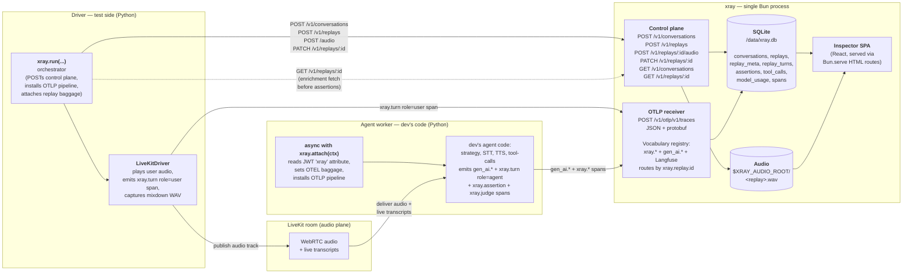
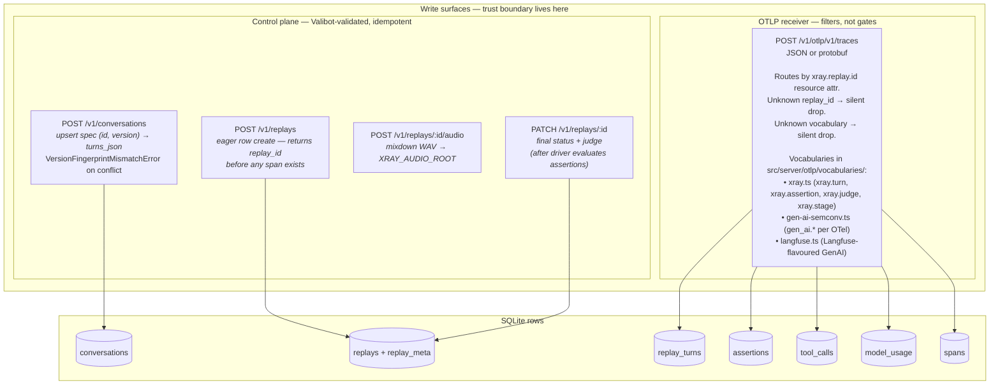
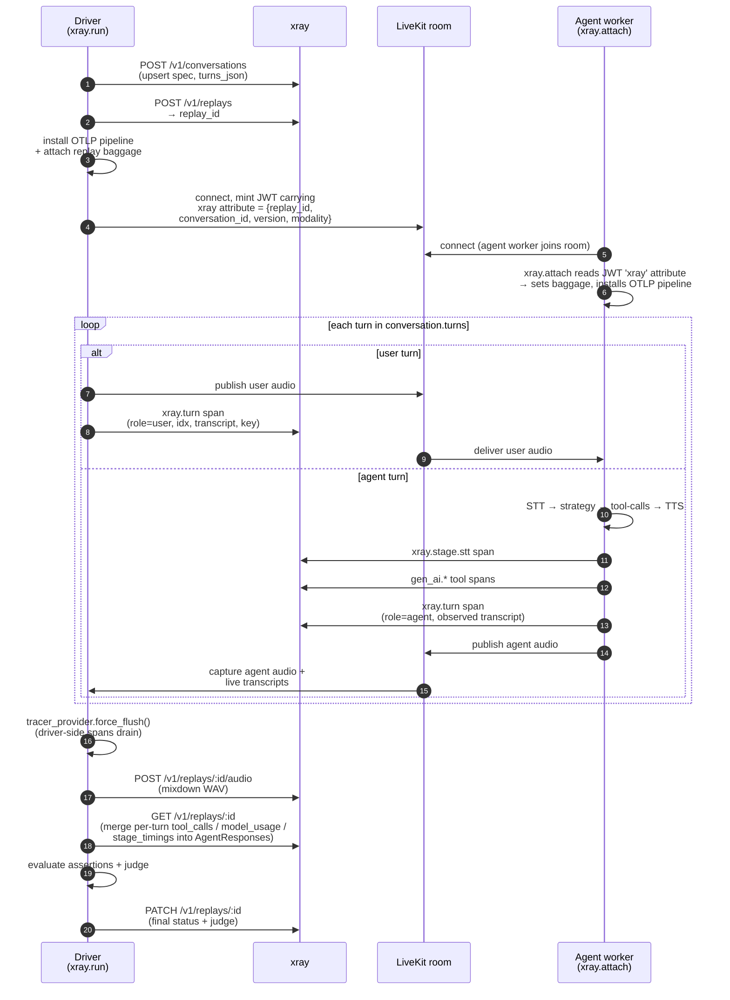
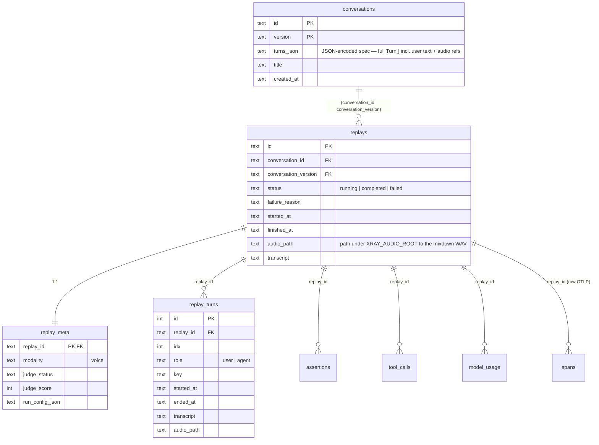
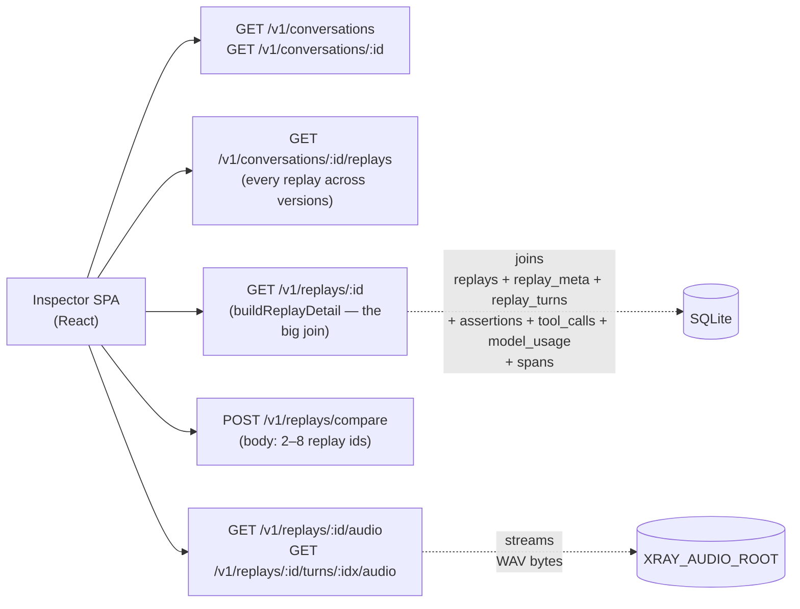

# xray architecture

This doc is the map for anyone contributing to xray. It explains the
three processes, the two write paths into storage, the read path that
backs the inspector, and the trust boundary between them.

End-user integration instructions live in [`integrate.md`](./integrate.md).

---

## TL;DR

- Three independent processes: the **driver** (test side, Python), the
  **agent worker** (dev's code, Python), and **xray** itself (a single
  Bun process serving SPA + HTTP API + OTLP receiver).
- xray has **exactly two write surfaces**: the SDK control plane
  (the driver POSTs Conversations / Replays here, the only trusted
  source for those rows) and the OTLP/HTTP receiver (both sides emit
  spans here; routed by `xray.replay.id`, filtered by vocabulary).
- Storage is one **SQLite file** at `/data/xray.db` plus audio bytes
  on disk under `XRAY_AUDIO_ROOT`. No external services. No second
  container. See [`single-image-distribution.md`](../.claude/rules/single-image-distribution.md)
  for why this is non-negotiable.
- The **inspector SPA** is served by the same Bun process that owns
  the API — one image, one port, one volume.

---

## The three processes



### Why three processes

- The **driver** runs in CI or on the dev's laptop. It owns the test
  spec, plays the user audio, evaluates assertions, decides
  pass/fail. It is also the only thing that mints LiveKit JWTs
  carrying the `xray` attribute (replay_id, conversation_id,
  conversation_version, modality) — that JWT is how the agent side
  learns which replay it's inside.
- The **agent worker** is the dev's own LiveKit Agents code, with one
  thin xray wrapper: `async with xray.attach(ctx, …)`. It runs the
  same way it would in production (because in production, no xray
  attribute is on the JWT, and `attach` no-ops). Its job from xray's
  point of view is *to emit OTEL spans*.
- **xray** is the single Bun image that takes both inputs and renders
  the inspector. No background workers. No queue. No second
  container.

The driver and the agent worker **never talk to each other directly**.
They share state through (a) the LiveKit room (audio + JWT attribute),
and (b) xray itself (every span lands under the same `xray.replay.id`).

---

## The two write paths

xray has exactly two write surfaces. Every byte that mutates state in
`/data/xray.db` arrives through one of them. They are coupled by trust:
the OTLP receiver **never** creates Conversation or Replay rows; that
is exclusively the SDK control plane's job.



### Control plane (driver only)

`sdk/python/src/xray/orchestrator.py:run(...)` POSTs to four endpoints
in order:

1. `POST /v1/conversations` — Valibot-validated upsert keyed by
   `(id, version)`. The SDK auto-computes `version` as a fingerprint
   over the canonical turn structure; the server rejects a same-key
   upsert with a different fingerprint as `VersionFingerprintMismatchError`.
2. `POST /v1/replays` — creates the Replay row **eagerly** and
   returns `replay_id`. This must happen before the runtime emits
   its first span; otherwise the OTLP receiver would drop them as
   "unknown replay_id."
3. `POST /v1/replays/:id/audio` — uploads the mixdown WAV (driver's
   captured user audio left-channel + captured agent audio
   right-channel, written to `XRAY_AUDIO_ROOT`).
4. `PATCH /v1/replays/:id` — final status + judge result, after the
   driver evaluates per-turn assertions and the per-replay judge.

### OTLP receiver (both sides)

`src/server/otlp/otlp.service.ts` accepts both `application/json` and
`application/x-protobuf`, normalises to a JSON-shape that the
existing Valibot schema validates, then dispatches each span through
the vocabulary registry (`src/server/otlp/vocabularies/registry.ts`).

Each registered vocabulary is one file. To add a new one (e.g. a
provider-specific semconv), drop a file in `vocabularies/` plus one
line in `registry.ts`. The receiver is a **filter, not a gate**:
- Unknown vocabulary → silently dropped (so an agent worker emitting
  noisy framework spans doesn't pollute storage).
- Unknown `xray.replay.id` → silently dropped (so an agent running in
  production, where there is no replay context, doesn't write rows).

The four xray-specific span kinds the registry knows about:
- `xray.turn` (role=user from driver, role=agent from agent worker) →
  `replay_turns` row carrying idx, role, key, transcript, timestamps.
- `xray.assertion` → `assertions` row.
- `xray.judge` → judge fields on `replay_meta`.
- `xray.stage` (stt, tts) → raw span only; surfaced for per-stage
  latency in the inspector.

GenAI semconv (`gen_ai.tool` → `tool_calls`, `gen_ai.client.operation`
→ `model_usage`) flows the same way.

---

## Replay lifecycle (single replay, time order)



Two things to notice in this diagram:

- **The audio plane (LiveKit) and the observability plane (OTLP) are
  separate.** Audio never goes through xray during the run; xray just
  receives the post-hoc mixdown WAV and the OTEL spans. The agent
  worker's STT is the dev's STT — xray sees only its emitted spans.
- **The replay row is created _before_ any spans land.** This is what
  makes the OTLP receiver's "unknown replay_id → drop" rule safe: by
  the time the agent worker emits its first span, the Replay row
  already exists, so the receiver routes the span correctly.

---

## Storage



`replay_turns` is the join point between the spec (`conversations.turns_json`)
and the observed execution. Each row comes from an `xray.turn` span;
role=user rows are emitted by the driver (LiveKitDriver), role=agent
rows are emitted by the dev's agent worker via the GenAI / xray
vocabulary on the OTLP receiver.

---

## Read path — what the inspector sees

The inspector (`src/client/inspector/` + slice folders under
`src/client/`) is a React SPA bundled by Bun's HTML bundler and
served by the same Bun process that owns the API. There is **no
client-side build step in CI**; Bun builds it at request time and at
container start.



Every read endpoint is in `src/server/<slice>/<slice>.router.ts`. The
service layer (`<slice>.service.ts`) does the actual SQL via Drizzle
on `bun:sqlite`. The slice convention is documented in
[`code-layout.md`](../.claude/rules/code-layout.md).

---

## Distribution

Shipped artifact: a Docker image published to GHCR
(`ghcr.io/xray-eval/xray`) by CI on tagged releases. Operators run

```
docker run -v ./data:/data -e XRAY_AUDIO_ROOT=/data/audio ghcr.io/xray-eval/xray
```

and that is the install. The image carries the Bun process, the
pre-built SPA, the SQLite schema (migrated at startup), and nothing
else. No SaaS. No hosted version. No second container.

This single-image promise is load-bearing for several other choices
in the codebase (SQLite over Postgres, `bun:sqlite` over a network
driver, embedded reads over a separate query service). See
[`single-image-distribution.md`](../.claude/rules/single-image-distribution.md)
before proposing any change that would break it.
