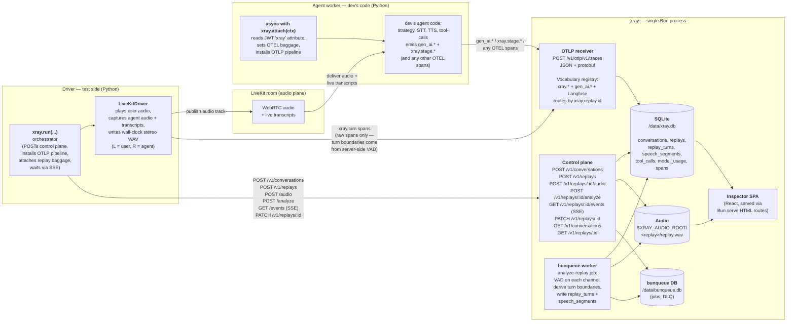
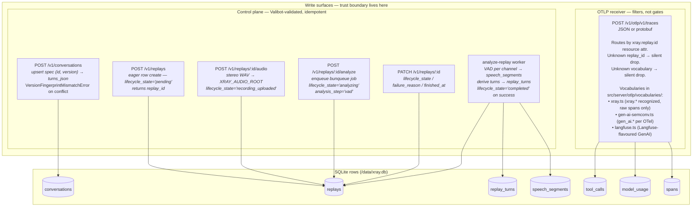
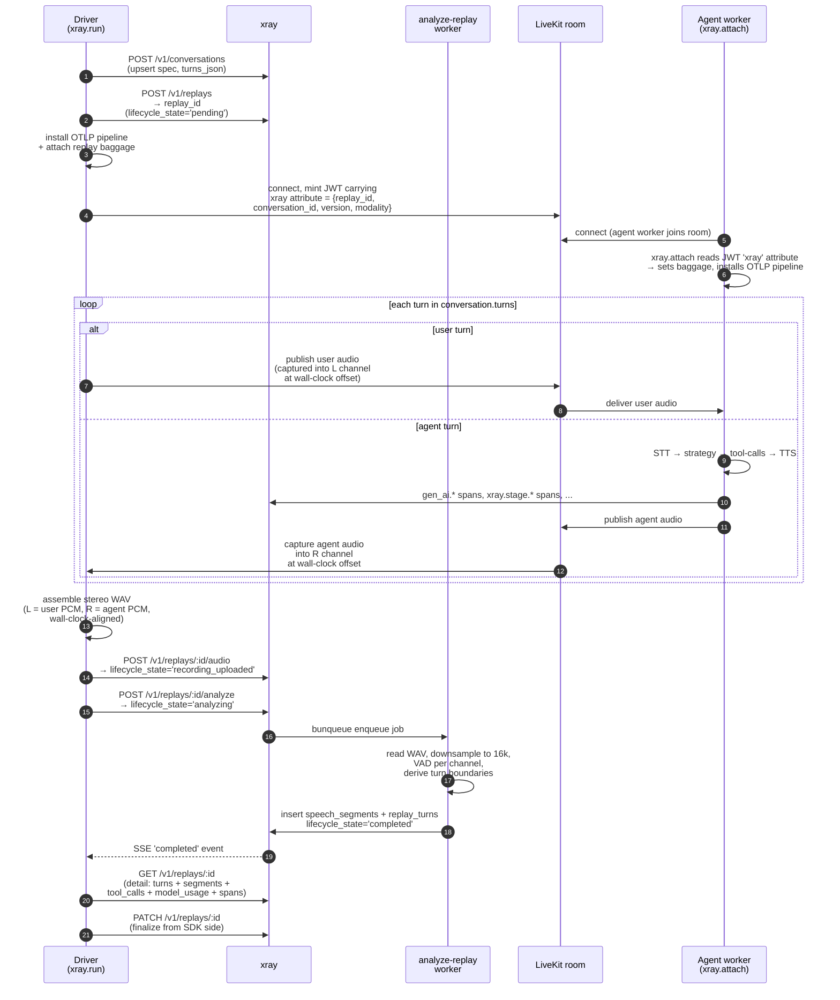
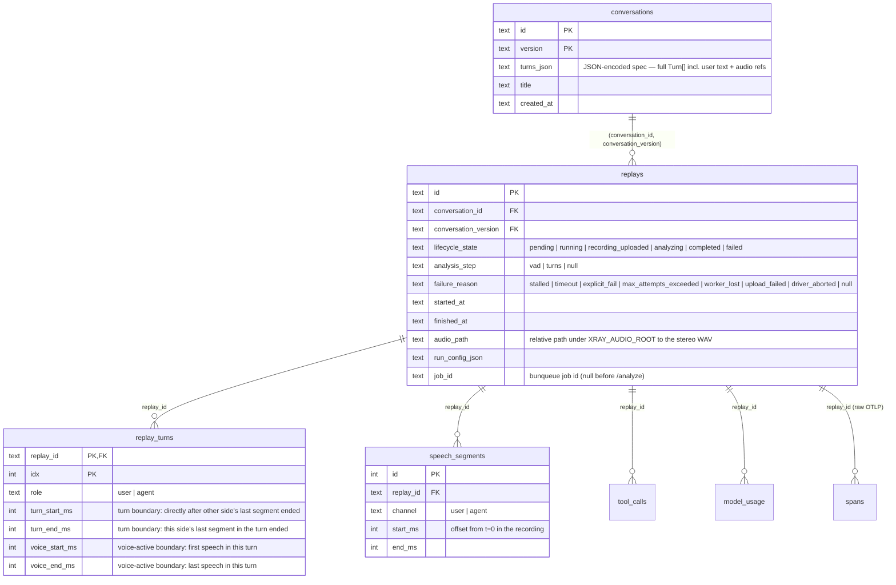
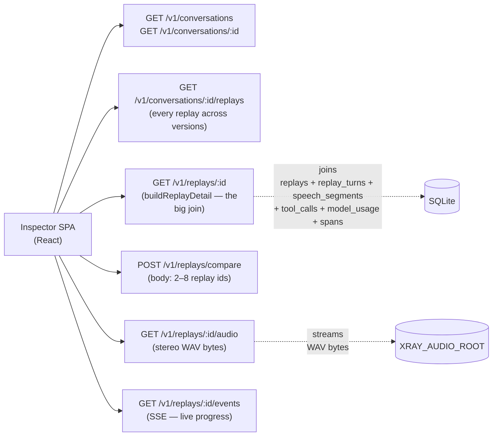

# xray architecture

This doc is the map for anyone contributing to xray. It explains the
three processes, the two write paths into storage, the read path that
backs the inspector, and the trust boundary between them.

End-user integration instructions live in [`integrate.md`](./integrate.md).

---

## TL;DR

- Three independent processes: the **driver** (test side, Python), the
  **agent worker** (dev's code, Python), and **xray** itself (a single
  Bun process serving SPA + HTTP API + OTLP receiver + a background
  job worker).
- xray has **exactly two write surfaces**: the SDK control plane
  (the driver POSTs Conversations / Replays here, the only trusted
  source for those rows) and the OTLP/HTTP receiver (both sides emit
  spans here; routed by `xray.replay.id`, filtered by vocabulary).
- **Server-side analysis.** The driver uploads a 48kHz int16 stereo
  WAV (left = user, right = agent) on completion. The server runs
  per-channel VAD, derives turn boundaries from the segments, and
  writes `speech_segments` + `replay_turns` rows. The driver waits via
  SSE on `/v1/replays/:id/events`.
- Storage is one **SQLite file** at `/data/xray.db` plus the bunqueue
  job DB at `/data/bunqueue.db`, plus audio bytes on disk under
  `XRAY_AUDIO_ROOT`. No external services. No second container. See
  [`single-image-distribution.md`](../.claude/rules/single-image-distribution.md)
  for why this is non-negotiable.
- The **inspector SPA** is served by the same Bun process that owns
  the API — one image, one port, one volume.

---

## The three processes



### Why three processes

- The **driver** runs in CI or on the dev's laptop. It owns the test
  spec, plays the user audio, captures the agent audio, writes the
  stereo WAV, uploads it, then waits via SSE for the server to finish
  VAD + turn derivation. It is also the only thing that mints LiveKit
  JWTs carrying the `xray` attribute (replay_id, conversation_id,
  conversation_version, modality) — that JWT is how the agent side
  learns which replay it's inside.
- The **agent worker** is the dev's own LiveKit Agents code, with one
  thin xray wrapper: `async with xray.attach(ctx, …)`. It runs the
  same way it would in production (because in production, no `xray`
  attribute is on the JWT, and `attach` no-ops). Its job from xray's
  point of view is *to emit OTEL spans*.
- **xray** is the single Bun image that takes both inputs and renders
  the inspector. The analyze-replay job runs in-process via bunqueue
  in `embedded` mode — no second container, no Redis, no separate
  worker process.

The driver and the agent worker **never talk to each other directly**.
They share state through (a) the LiveKit room (audio + JWT attribute),
and (b) xray itself (every span lands under the same `xray.replay.id`).

---

## The two write paths

xray has exactly two write surfaces. Every byte that mutates state in
`/data/xray.db` arrives through one of them. They are coupled by trust:
the OTLP receiver **never** creates Conversation or Replay rows; that
is exclusively the SDK control plane's job.



### Control plane (driver only)

`sdk/python/src/xray/orchestrator.py:run(...)` POSTs to these endpoints
in order:

1. `POST /v1/conversations` — Valibot-validated upsert keyed by
   `(id, version)`. The SDK auto-computes `version` as a fingerprint
   over the canonical turn structure; the server rejects a same-key
   upsert with a different fingerprint as
   `VersionFingerprintMismatchError`.
2. `POST /v1/replays` — creates the Replay row **eagerly** at
   `lifecycle_state='pending'` and returns `replay_id`. This must
   happen before the runtime emits its first span; otherwise the OTLP
   receiver would drop them as "unknown replay_id."
3. `POST /v1/replays/:id/audio` — uploads the stereo WAV (left = user,
   right = agent, wall-clock-aligned, written under
   `XRAY_AUDIO_ROOT/<replay_id>/replay.<ext>`). The server flips
   `lifecycle_state` to `recording_uploaded`.
4. `POST /v1/replays/:id/analyze` — enqueues the bunqueue
   `analyze-replay` job. The server transitions to
   `lifecycle_state='analyzing'` with `analysis_step='vad'`. Returns
   `202 Accepted` with the bunqueue job id.
5. `GET /v1/replays/:id/events` (SSE) — the SDK streams `state`,
   `progress`, `completed`, and `failed` events. Heartbeat `:` line
   every 15s keeps proxies from idling out. SDK closes the stream when
   `lifecycle_state` hits a terminal value.
6. `PATCH /v1/replays/:id` — final SDK-side fields (the SDK's local
   judge / assertion eval is informational only in v0.2; the server
   accepts `lifecycle_state` / `failure_reason` / `finished_at` and
   silently strips other keys).

### OTLP receiver (both sides)

`src/server/otlp/otlp.service.ts` accepts both `application/json` and
`application/x-protobuf`, normalises to a JSON-shape that the
Valibot schema validates, then dispatches each span through the
vocabulary registry (`src/server/otlp/vocabularies/registry.ts`).

Each registered vocabulary is one file. To add a new one (e.g. a
provider-specific semconv), drop a file in `vocabularies/` plus one
line in `registry.ts`. The receiver is a **filter, not a gate**:
- Unknown vocabulary → silently dropped (so an agent worker emitting
  noisy framework spans doesn't pollute storage).
- Unknown `xray.replay.id` → silently dropped (so an agent running in
  production, where there is no replay context, doesn't write rows).

**xray vocabulary** (`src/server/otlp/vocabularies/xray.ts`) — recognized
span names: `xray.turn`, `xray.assertion`, `xray.judge`, `xray.stage.stt`,
`xray.stage.tts`. In v0.2 these are accepted (so they land in the raw
`spans` table for the inspector's timeline) but no longer produce
structured rows — turn boundaries come from server-side VAD; assertion
+ judge are SDK-side evaluations until the server-side eval flow ships
in a follow-up PR. `xray.turn` is emitted by the **driver** (LiveKitDriver
wraps each played user turn and each captured agent turn in an `xray.turn`
span) — useful for the inspector's per-turn timeline view, redundant with
the VAD-derived turn boundaries the server writes to `replay_turns`.

**gen_ai semconv** (`gen-ai-semconv.ts`) — `gen_ai.tool` → `tool_calls`,
`gen_ai.client.operation` → `model_usage`. **Langfuse** vocabulary
(`langfuse.ts`) extracts the same shapes from Langfuse-flavoured GenAI.

---

## Replay lifecycle (single replay, time order)



Two things to notice in this diagram:

- **The audio plane (LiveKit) and the observability plane (OTLP) are
  separate.** Audio never goes through xray during the run; xray just
  receives the post-hoc stereo WAV. The agent worker's STT is the
  dev's STT — xray sees only its emitted OTEL spans.
- **The replay row is created _before_ any spans land.** This is what
  makes the OTLP receiver's "unknown replay_id → drop" rule safe: by
  the time the agent worker emits its first span, the Replay row
  already exists, so the receiver routes the span correctly.

---

## Storage



`replay_turns` is the join point between the spec
(`conversations.turns_json`) and the observed execution. Rows are
written by the `analyze-replay` worker after running VAD on each
channel of the uploaded stereo WAV. `speech_segments` carries the raw
VAD output (one row per detected voiced chunk per channel); the
inspector renders these alongside the turn boundaries for debugging
overlap / silence / latency.

`tool_calls`, `model_usage`, and `spans` are written by the OTLP
receiver as it ingests `gen_ai.*` / Langfuse / `xray.*` spans.

---

## Read path — what the inspector sees

The inspector (`src/client/inspector/` + slice folders under
`src/client/`) is a React SPA bundled by Bun's HTML bundler and
served by the same Bun process that owns the API. There is **no
client-side build step in CI**; Bun builds it at request time and at
container start.

> **Note (v0.2):** the inspector SPA is intentionally not yet updated
> for the audio-ground-truth schema. The server endpoints return the
> new shape, so the SPA currently shows broken state for replay
> detail. A follow-up PR rebuilds the inspector against the new
> `replay_turns` + `speech_segments` shape.



Every read endpoint is in `src/server/<slice>/<slice>.router.ts`. The
service layer (`<slice>.service.ts`) does the actual SQL via Drizzle
on `bun:sqlite`. The slice convention is documented in
[`code-layout.md`](../.claude/rules/code-layout.md).

---

## Distribution

Shipped artifact: a Docker image published to GHCR
(`ghcr.io/xray-eval/xray`) by CI on tagged releases. Operators run

```
docker run -v ./data:/data -e XRAY_AUDIO_ROOT=/data/audio ghcr.io/xray-eval/xray
```

and that is the install. The image carries the Bun process, the
pre-built SPA, the SQLite schema (migrated at startup), the bunqueue
worker (embedded, same process), and nothing else. No SaaS. No hosted
version. No second container.

This single-image promise is load-bearing for several other choices
in the codebase (SQLite over Postgres, `bun:sqlite` over a network
driver, embedded reads over a separate query service, embedded
bunqueue worker over a separate queue process). See
[`single-image-distribution.md`](../.claude/rules/single-image-distribution.md)
before proposing any change that would break it.

**Two SQLite files in `/data/`.** xray owns `xray.db` (conversations,
replays, etc.). bunqueue owns `bunqueue.db` (jobs, DLQ). Acknowledged
tradeoff vs the "one file" reading of the rule — single volume, two
files, no second process. Operator backs up the whole `/data` volume.
Path is configurable via `BUNQUEUE_DATA_PATH`.
