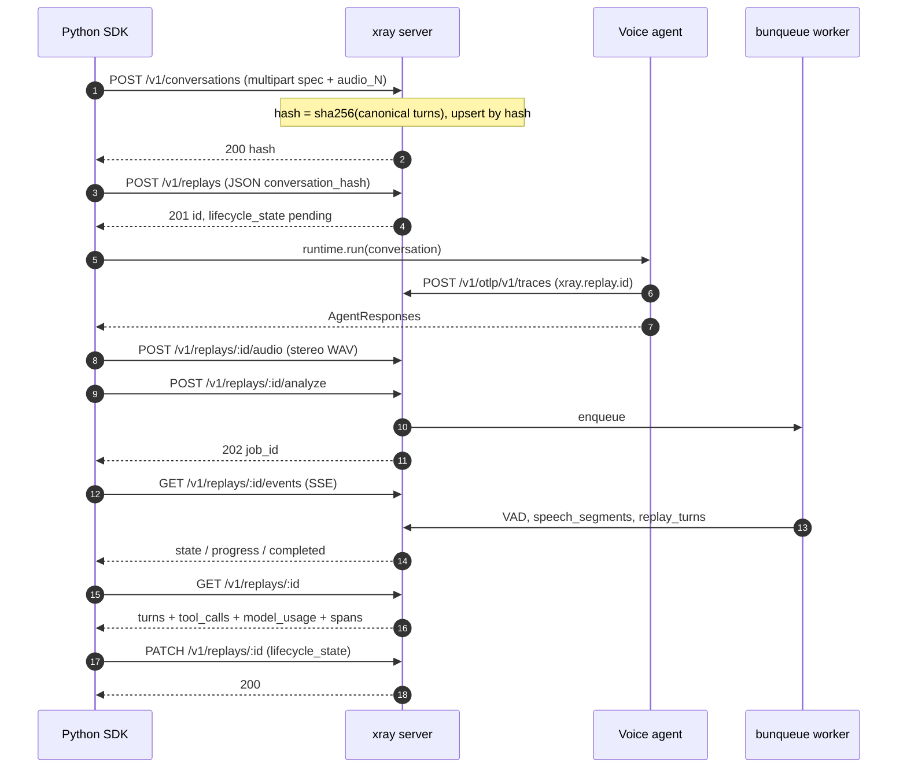

# Integrating xray into an existing LiveKit Agents worker

This is the canonical walkthrough. If you've got a LiveKit Agents
worker today and you want xray to record + replay its conversations,
read top-to-bottom and copy the code blocks.

You'll need:

- xray running. Latest image, mounted volume for `/data`. The
  reference compose snippet is at the bottom of this doc.
- LiveKit server **≥ v1.7** reachable from both the test driver and
  the agent worker (the xray SDK propagates the replay context via
  `participant.attributes`, added in 1.7).
- Python **3.10+** for the agent. The xray SDK runs on the same
  Python you ship your agent on; no version uplift required.

The example below is a real-world voice-service worker; the wiring
is identical for any LiveKit Agents codebase.

## Request flow at a glance

`xray.run(...)` orchestrates the calls below. You don't write any of
them by hand — but this is the sequence to keep in your head when
something fails:



Two surfaces, one trust boundary: the **control plane** (the first
two POSTs + the audio / analyze / events / PATCH calls) is the only
write path that can create rows. The **OTLP receiver** (the agent's
`POST /v1/otlp/v1/traces`) is a *filter*: spans tagged with an
unknown `xray.replay.id` are dropped silently. That's safe precisely
because the replay row exists before the runtime emits its first
span.

---

## 1. Install the SDK on the agent side

```bash
pip install xray-py[livekit]
```

The `[livekit]` extra pulls in `livekit` + `livekit-api`. Drop it if
you implement your own driver class.

Set `XRAY_OTLP_ENDPOINT` on the agent worker:

```bash
export XRAY_OTLP_ENDPOINT=http://xray:8080
```

xray's OTLP receiver accepts both `application/x-protobuf` (the stock
OTel HTTP exporter's default) and `application/json`, so existing OTEL
pipelines work too — `xray.attach` ships an OTLP/JSON exporter
configured to point at xray.

---

## 2. Wrap the worker entrypoint with `xray.attach`

```python
import xray
from livekit.agents import JobContext, WorkerOptions, cli, AutoSubscribe

async def entrypoint(ctx: JobContext) -> None:
    await ctx.connect(auto_subscribe=AutoSubscribe.AUDIO_ONLY)

    async with xray.attach(ctx, service_name="my-agent") as session:
        # `session` is None when no xray-tagged participant joined.
        # Inside the block, OTEL baggage carries:
        #   xray.replay.id, xray.conversation.hash, xray.modality
        # The bundled span processor lifts those onto every span at start.
        # On block exit, the tracer provider force-flushes so spans land
        # in xray before the worker shuts down.

        # Your existing strategy / pipeline runs here:
        await your_agent.run(ctx, session=session)


cli.run_app(WorkerOptions(entrypoint_fnc=entrypoint))
```

Notes:

- `xray.attach` is an **async context manager**, not a decorator.
  Decorator wrappers break LiveKit Agents' multiprocessing
  forkserver pickling (the agent runs each job in a fresh
  subprocess that picks up the entrypoint by `__main__.entrypoint`
  lookup).
- Call `xray.attach` **after** `ctx.connect(...)` — before connect,
  `ctx.room.remote_participants` is empty and the bind has nothing
  to scan.

---

## 3. Emit OTEL spans

xray's OTLP receiver accepts every span the agent worker emits.
Recognized vocabularies (`xray.*`, OTel GenAI `gen_ai.*`, Langfuse
`langfuse.*`) get persisted as raw spans AND extracted into structured
rows where the vocabulary supports it:

- `gen_ai.tool` → `tool_calls` row.
- `gen_ai.client.operation` (and Langfuse equivalents) → `model_usage`
  row.
- `xray.*` spans land in the raw `spans` table only in v0.2 — no
  structured extraction (assertion / judge eval moves to the server in
  a follow-up PR).

Spans from unrecognized vocabularies are dropped silently — that's the
"filter, not a gate" design so noisy framework spans don't fill the DB.

Tool calls / model usage from any OTel-instrumented LLM client (the
`opentelemetry-instrumentation-openai-v2` package, Langfuse, etc.)
land in xray automatically. No xray-specific code required.

---

## 4. Write a test

```python
import asyncio
import xray
from xray.conversation import RecordedAudio
from xray.runtime.livekit import LiveKitDriver


async def main():
    conv = xray.Conversation(
        id="booking-happy-path",
        turns=[
            xray.Turn.agent(key="a-greeting"),
            xray.Turn.user(
                "Book a table for two at 7pm.",
                key="u-question",
                audio=RecordedAudio(path="/path/to/utterance.wav"),
            ),
            xray.Turn.agent(
                key="a-answer",
                assertion=lambda a: "confirmed" in a.transcript.lower(),
                assertion_name="confirms_booking",
            ),
        ],
    )

    driver = LiveKitDriver(
        url="ws://localhost:7880",
        api_key="devkey",
        api_secret="devsecret32charsminimumlengthxyz123",
        room=f"booking-test-{__import__('uuid').uuid4().hex[:6]}",
    )

    result = await xray.run(
        conversation=conv,
        runtime=driver,
        xray_url="http://localhost:8080",
        run_config=xray.RunConfig(model="gpt-4o", temperature=0.5),
    )
    print(f"replay: {result.url}")
    print(f"status: {result.status}")
    for a in result.assertions:
        print(f"  {a.name}: {a.status}")


asyncio.run(main())
```

`xray.run` is async — wrap in `asyncio.run` for sync test harnesses.
There is no sync `xray.run`; the previous one was a footgun in
already-running loops (pytest-asyncio, Jupyter, LiveKit Agents).

What `xray.run` does:

1. POST the Conversation (idempotent upsert).
2. POST the Replay row eagerly (`lifecycle_state='pending'`).
3. Bind the driver, attach replay baggage, run the driver — playing
   user audio + capturing agent audio + transcripts.
4. Assemble a 48kHz int16 **stereo WAV** (L = user, R = agent,
   wall-clock-aligned) and POST it to `/v1/replays/:id/audio`.
5. POST `/v1/replays/:id/analyze` — server enqueues the
   `analyze-replay` bunqueue job which runs VAD per channel + derives
   turn boundaries.
6. Stream SSE on `/v1/replays/:id/events` until `lifecycle_state` hits
   `completed` or `failed`.
7. Fetch the final replay detail (turns + speech_segments +
   tool_calls + model_usage + spans).
8. Evaluate per-turn assertions + per-replay judge locally (SDK-side
   in v0.2; server-side in a follow-up PR).
9. PATCH the replay with the final state.

User-turn audio formats:

- `RecordedAudio(path=...)` — 48 kHz mono int16 WAV on disk.
- `TtsAudio()` — synthesized via OpenAI TTS at runtime
  (`OPENAI_API_KEY` required; the key stays in your process, never
  reaches xray).

For Cartesia / 11Labs / Deepgram, synthesize externally and pass the
output as `RecordedAudio` — multi-provider TTS Protocol is on the
v0.2 roadmap.

---

## 5. Read the result

`AgentResponse` (handed to per-turn assertions) carries the
server-side view:

- `transcript` — published `rtc.Transcription` segments (your agent
  must publish them; see your provider's docs).
- `tool_calls` — `tuple[ToolCall]` of `gen_ai.tool` spans for this turn.
- `model_usage` — `tuple[ModelUsage]` of `gen_ai.usage.*` rollups.
- `stage_timings` — `dict[str, float]` of `xray.stage.*` durations.

`ReplayResult` (handed to the per-replay judge) carries the same view
across all turns plus the full transcript.

The final `RunResult.status` reflects whether the driver-side run
completed; turn boundaries derived by the server's VAD pipeline are
available via `GET /v1/replays/:id` (under `turns` + `speech_segments`
in the response) — the inspector will render these once it's updated
in a follow-up PR.

---

## 6. Run xray itself

Production-shape compose:

```yaml
services:
  xray:
    image: ghcr.io/xray-eval/xray:0.2.0
    restart: unless-stopped
    ports: ["8080:8080"]
    volumes: ["xray-data:/data"]
    read_only: true
    cap_drop: [ALL]
    security_opt: ["no-new-privileges:true"]
    # Optional: move bunqueue's SQLite file out of /data
    # environment:
    #   BUNQUEUE_DATA_PATH: /data/bunqueue.db

volumes:
  xray-data:
```

xray ships as a single Docker image. Two SQLite files share the
mounted volume:

- `/data/xray.db` — conversations, replays, replay_turns,
  speech_segments, tool_calls, model_usage, spans.
- `/data/bunqueue.db` — bunqueue's job queue + DLQ (the
  `analyze-replay` worker runs embedded in the same Bun process).

Inspector UI at `http://localhost:8080`. (Note for v0.2: the SPA is
not yet rebuilt against the new schema; expect rendering glitches
until the inspector follow-up PR.)

---

## What changed from earlier alphas

xray-py is at **v0.2.0** — server is now the analyzer:

- The server runs server-side VAD on the driver's uploaded stereo WAV
  and derives turn boundaries. `replay_turns` rows have
  `turn_start_ms` / `turn_end_ms` / `voice_start_ms` / `voice_end_ms`
  instead of the old `started_at` / `ended_at` / `transcript` /
  `audio_path` shape.
- Replay row gains `lifecycle_state` (`pending` | `running` |
  `recording_uploaded` | `analyzing` | `completed` | `failed`),
  `analysis_step`, and `job_id`.
- New endpoints: `POST /v1/replays/:id/analyze`, `GET
  /v1/replays/:id/events` (SSE).
- Driver writes a wall-clock-aligned stereo WAV (left = user, right =
  agent), not the turn-sequential mixdown the alpha used. Barge-in /
  agent latency are now representable in the file.
- Dropped: `replay_meta` table (judge fields) and `assertions` table.
  `xray.assertion` + `xray.judge` OTLP spans still land in the raw
  `spans` table; SDK still evaluates the dev's lambda assertions
  client-side; structured assertion / judge storage returns in a
  follow-up PR.
- `xray.run` is async-only. No more sync `run()` collision with
  running loops.
- `Turn.user(...)` + `Turn.agent(...)`. `expect_agent_turn` is gone.
- `LiveKitDriver` (not `LiveKitRuntime`) — name reflects user-side
  test driver, not a LiveKit Agents runtime.
- `xray.attach(ctx)` async-CM is the single entry point on the agent
  side.
- Replay context propagates via the JWT's `xray` attribute
  (LiveKit `participant.attributes` ≥ v1.7), not via participant
  metadata.
- Wire is snake_case end-to-end. `conversation_hash`,
  `lifecycle_state`, `failure_reason`, `started_at`. Both OTLP/JSON
  and OTLP/Protobuf are accepted on the receiver.
- `RunConfig` is a typed dataclass (`model`, `temperature`, `extra`).
- Failure classification is typed-error-only. No more substring
  matching on `str(exception)`.
