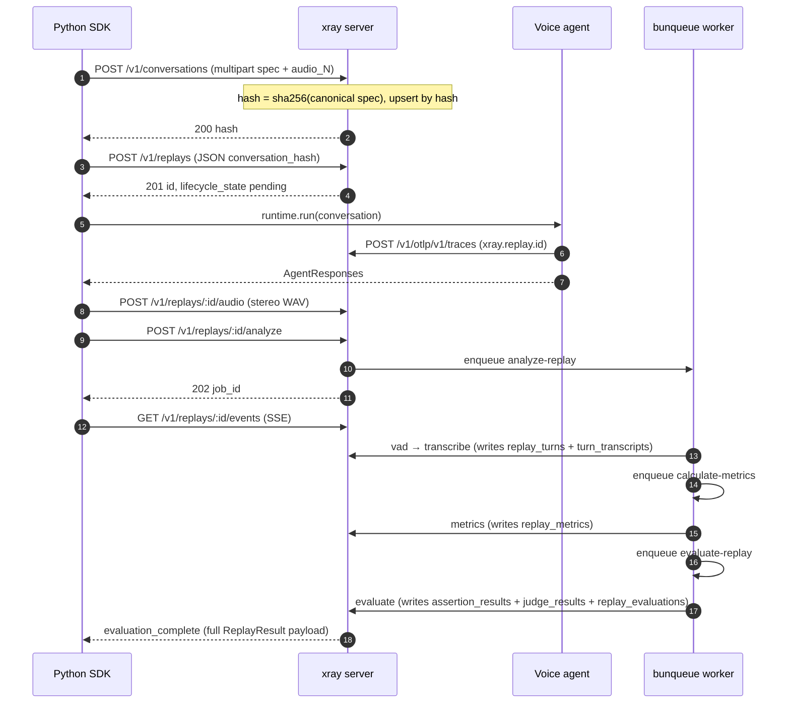

# Integrating xray into an existing LiveKit Agents worker

This is the main walkthrough. LiveKit Agents is a framework for building voice agents (programs you talk to). A "worker" is the process that runs your agent.

Do you already have a LiveKit Agents worker? Do you want xray to record and replay its conversations? Then read this page top-to-bottom and copy the code blocks.

You'll need:

- xray running. Use the latest image, with a mounted volume for `/data`. The reference compose snippet is at the bottom of this doc.
- LiveKit server **≥ v1.7**. It must be reachable from both the test driver and the agent worker. The xray SDK propagates the replay context through `participant.attributes`, a field added in 1.7. ("Propagate" here means it passes the replay info along so the agent can read it.)
- Python **3.10+** for the agent. The xray SDK runs on the same Python you ship your agent on. You do not need to upgrade your Python version.

The example below is a real voice-service worker. The wiring is the same for any LiveKit Agents codebase.

## Request flow at a glance

`xray.run(...)` makes the calls below for you. You don't write any of them by hand. But this is the sequence to keep in your head when something fails:



There are two surfaces, with one trust boundary between them.

- The **control plane** is the first two POSTs, plus the audio, analyze, events, and PATCH calls. It is the only write path that can create rows in the database.
- The **OTLP receiver** is the agent's `POST /v1/otlp/v1/traces`. (OTLP is the OpenTelemetry Protocol, a standard way to send tracing data. A "span" is one timed unit of work in a trace, like a single tool call.) This receiver is a *filter*. If a span is tagged with an `xray.replay.id` the server doesn't know, the span is dropped without an error.

Why is dropping unknown spans safe? Because the replay row is always created first, before the runtime sends its first span. So a known replay id always has a row waiting for it.

---

## 1. Install the SDK on the agent side

```bash
pip install "xray-py[livekit]"
```

The `[livekit]` extra pulls in `livekit` and `livekit-api`. (An "extra" is an optional set of dependencies you opt into with the square brackets.) Drop the `[livekit]` part if you write your own driver class.

Set `XRAY_OTLP_ENDPOINT` on the agent worker:

```bash
export XRAY_OTLP_ENDPOINT=http://xray:8080
```

xray's OTLP receiver accepts two formats:

- `application/x-protobuf`, which is the stock OTel HTTP exporter's default.
- `application/json`.

So your existing OpenTelemetry pipelines work too. `xray.attach` ships an OTLP/JSON exporter already pointed at xray.

---

## 2. Wrap the worker entrypoint with `xray.attach`

```python
import xray
from livekit.agents import JobContext, WorkerOptions, cli, AutoSubscribe

async def entrypoint(ctx: JobContext) -> None:
    await ctx.connect(auto_subscribe=AutoSubscribe.AUDIO_ONLY)

    async with xray.attach(ctx, service_name="my-agent") as session:
        # `session` is None when no xray-tagged participant joined.
        # Inside the block, OTEL baggage carries:
        #   xray.replay.id, xray.conversation.hash, xray.modality
        # The bundled span processor lifts those onto every span at start.
        # On block exit, the tracer provider force-flushes so spans land
        # in xray before the worker shuts down.

        # Your existing strategy / pipeline runs here:
        await your_agent.run(ctx, session=session)


cli.run_app(WorkerOptions(entrypoint_fnc=entrypoint))
```

Notes:

- `xray.attach` is an **async context manager**, not a decorator. (A context manager is the `async with` block above. It runs setup code when you enter and cleanup code when you exit.) Decorator wrappers break LiveKit Agents' multiprocessing forkserver pickling. LiveKit runs each job in a fresh subprocess, and that subprocess finds the entrypoint by looking up `__main__.entrypoint`.
- Call `xray.attach` **after** `ctx.connect(...)`. Before connect, `ctx.room.remote_participants` is empty, so the bind has nothing to scan.

---

## 3. Emit OTEL spans

xray's OTLP receiver accepts every span the agent worker emits. ("Emit" means the agent sends the span out.)

Some vocabularies are recognized: `xray.*`, OTel GenAI `gen_ai.*`, and Langfuse `langfuse.*`. (A "vocabulary" is a known set of attribute names.) Recognized spans are saved as raw spans. They are also pulled into structured database rows when the vocabulary supports it:

- `gen_ai.operation.name = execute_tool` becomes a `tool_calls` row.
- `gen_ai.operation.name = chat` or `text_completion` (and the Langfuse `generation` observation) becomes a `model_usage` row.
- `xray.turn`, `xray.stage.stt`, and `xray.stage.tts` spans land in the raw `spans` table for the inspector's timeline. They carry no structured payload. Server evaluation runs from the declared `Assertion` and `Judge` variants, not from driver-emitted spans.

The full attribute contract is in [`wire-contract.md`](./wire-contract.md).

Spans from unrecognized vocabularies are dropped without an error. This is the "filter, not a gate" design. It keeps noisy framework spans from filling the database.

Tool calls and model usage land in xray automatically. This works for any OTel-instrumented LLM client, such as the `opentelemetry-instrumentation-openai-v2` package or Langfuse. No xray-specific code is required.

---

## 4. Write a test

```python
import asyncio
import xray
from xray import Assertion, Judge
from xray.conversation import RecordedAudio
from xray.runtime.livekit import LiveKitRuntime


async def main():
    conv = xray.Conversation(
        name="booking-happy-path",
        turns=[
            xray.Turn.agent(key="a-greeting"),
            xray.Turn.user(
                "Book a table for two at 7pm.",
                key="u-question",
                audio=RecordedAudio(path="/path/to/utterance.wav"),
            ),
            xray.Turn.agent(
                key="a-answer",
                assertions=(
                    Assertion.contains("confirmed"),
                    Assertion.tool_called("reserve_table"),
                    Assertion.tool_args_match("reserve_table", {"party_size": 2}),
                    Assertion.max_latency_ms(2_000),
                ),
            ),
        ],
        judges=(
            Judge.text_match(
                "The agent confirms a reservation for two at 7pm.",
                pass_score=80,
            ),
        ),
    )

    driver = LiveKitRuntime(
        url="ws://localhost:7880",
        api_key="devkey",
        api_secret="devsecret32charsminimumlengthxyz123",
        room=f"booking-test-{__import__('uuid').uuid4().hex[:6]}",
    )

    result = await xray.run(
        conversation=conv,
        runtime=driver,
        xray_url="http://localhost:8080",
        run_config=xray.RunConfig(model="gpt-4o", temperature=0.5),
    )
    print(f"replay: {result.replay_id} passed={result.passed}")
    for a in result.assertions:
        print(f"  turn {a.turn_idx} [{a.kind}]: {a.status} {a.message or ''}")
    for j in result.judges:
        print(f"  judge {j.judge_idx} [{j.kind}]: {j.status} score={j.score} - {j.reason}")


asyncio.run(main())
```

In pytest the same call is one assertion:

```python
async def test_booking_happy_path():
    result = await xray.run(conversation=conv, runtime=driver, xray_url=XRAY_URL)
    assert result.passed, xray.format_failures(result)
```

`xray.run` is async. Wrap it in `asyncio.run` for sync test harnesses. There is no sync `xray.run`. The old sync version was a footgun in loops that are already running, such as pytest-asyncio, Jupyter, and LiveKit Agents.

What `xray.run` does:

1. POST the Conversation. This is an idempotent upsert, meaning calling it twice with the same input is safe. Assertions and judges are part of the canonical spec the server hashes.
2. POST the Replay row eagerly (`lifecycle_state='pending'`).
3. Bind the driver, attach replay baggage, and run the driver. This plays the user audio, then captures the agent audio and transcripts.
4. Assemble a 48 kHz int16 **stereo WAV** (L = user, R = agent, wall-clock-aligned) and POST it to `/v1/replays/:id/audio`. Set the `X-Recording-Started-At` header to the wall-clock time (ISO-8601 UTC) of audio sample 0. This anchor is the sole origin for mapping span timestamps onto the audio timeline. The server uses it to work out which turn each tool, model, and span row belongs to. **A custom `Runtime` that produces audio MUST report it.** Return `RuntimeResult.recording_started_at_epoch` (Unix epoch seconds of sample 0), and `xray.run` sends the header for you. If you omit it, span-to-turn attribution is skipped. Then every `tool_called`, `tool_not_called`, `tool_args_match`, and `max_ttft_ms` assertion comes back `errored`.
5. POST `/v1/replays/:id/analyze`. The server enqueues the three-stage analyze chain (`analyze-replay`, then `calculate-metrics`, then `evaluate-replay`).
6. Stream SSE on `/v1/replays/:id/events` until `evaluation_complete` (the chain finished) or `failed` (the chain stopped). (SSE is Server-Sent Events, a one-way stream of updates from the server.)
7. Translate the `evaluation_complete` payload into `xray.ReplayResult` and return it.

Failure model: assertion failures don't raise. They are outcomes on `result.assertions`. Infrastructure failures do raise `xray.ReplayEvaluationError`. Examples are the transcription provider being down or the judge LLM being unavailable.

User-turn audio formats:

- `RecordedAudio(path=...)`. This is a 48 kHz mono int16 WAV file on disk. It is uploaded to xray with the conversation spec.
- `TtsAudio()` (or no `audio` at all). This is synthesized **server-side** during the conversation upsert. (TTS means text-to-speech: turning written text into spoken audio.) The xray server uses whichever provider it is configured with (`XRAY_TTS_PROVIDER`: OpenAI, Google, or Mistral). The generated audio is stored content-addressed, and its sha256 is part of the conversation hash. The driver pulls the exact bytes back before joining the room. There is no TTS key in the SDK's process.

For Cartesia, 11Labs, or Deepgram, synthesize the audio yourself and pass the output as `RecordedAudio`. Adding more server-side TTS providers is one file each in `src/server/tts/`.

---

## 5. Read the result

`xray.run(...)` returns `xray.ReplayResult`:

- `passed: bool`. This is `True` only if every assertion *and* every judge ran to a `passed` status. An `errored` status counts as not-passed.
- `assertions: tuple[AssertionOutcome, ...]`. There is one entry per declared assertion, in the order they appear on each turn. Each one carries `turn_idx`, `assertion_idx`, `kind`, `status` (`passed`, `failed`, or `errored`), and `message` (the reason, set when the status is not passed).
- `judges: tuple[JudgeOutcome, ...]`. There is one entry per declared judge. Each one carries `judge_idx`, `kind`, `status`, the LLM's 0..100 `score`, and the LLM's natural-language `reason`.
- `metrics: tuple[TurnMetrics, ...]`. These are per-turn timings computed server-side: `agent_response_ms` and `interrupted`. (TTFT means time to first token. Model TTFT is a per-call attribute on the replay's `model_usage` rows. It is populated when the agent's instrumentation emits `gen_ai.response.time_to_first_chunk`. It is not a per-turn metric.)
- `replay_id` and `conversation_hash`. These point back to the server-side rows for follow-up inspection.

Do you need the live audio plus the turn boundaries the server derived? For example, for a custom UI or ad-hoc analysis. Then `GET /v1/replays/:id` carries the full detail. `GET /v1/replays/:id/result` returns the same `ReplayResult` payload outside of the SSE stream, so late subscribers can fetch it directly.

---

## 6. Run xray itself

Production-shape compose:

```yaml
services:
  xray:
    image: ghcr.io/xray-eval/xray:latest
    restart: unless-stopped
    ports: ["8080:8080"]
    volumes: ["xray-data:/data"]
    read_only: true
    cap_drop: [ALL]
    security_opt: ["no-new-privileges:true"]
    # Optional: move bunqueue's SQLite file out of /data
    # environment:
    #   BUNQUEUE_DATA_PATH: /data/bunqueue.db

volumes:
  xray-data:
```

xray ships as a single Docker image. Two SQLite files share the mounted volume:

- `/data/xray.db`. This holds conversations, replays, replay_turns, speech_segments, spans, tool_calls, model_usage, turn_transcripts, replay_metrics, assertion_results, judge_results, replay_evaluations, and tts_synth_cache (13 tables; see [`architecture.md`](./architecture.md)).
- `/data/bunqueue.db`. This holds bunqueue's job queue and DLQ. (DLQ means dead-letter queue, where failed jobs go.) The `analyze-replay` worker runs embedded in the same Bun process.

The inspector UI is at `http://localhost:8080`.

---

## What changed from earlier alphas

This release moves assertion and judge evaluation onto the server.

- **Declarative assertions + judges.** Replace per-turn lambdas with `Assertion.contains(...)`, `Assertion.tool_called(...)`, `Assertion.max_latency_ms(...)`, and so on. Replace per-replay judge callables with `Judge.text_match(reference, pass_score=...)`. Both ship on the wire and run server-side. So every SDK (Python today, others tomorrow) speaks the same shape.
- **`xray.run(...)` returns `ReplayResult`.** It includes `passed` plus per-assertion, per-judge, and per-turn-metrics data. Assertion failures don't raise. The pytest idiom is `assert result.passed, format_failures(result)`. Only infrastructure failures raise `ReplayEvaluationError`, such as the transcription provider being down or the judge crashing.
- **Three-stage server chain.** `/analyze` now enqueues `analyze-replay` (VAD plus per-turn Whisper transcription). That enqueues `calculate-metrics` (agent_response_ms, interrupted). That enqueues `evaluate-replay`, which runs all assertions and judges, then emits the `evaluation_complete` SSE. (VAD means voice activity detection: finding which parts of the audio contain speech.)
- **SSE event renamed.** The `completed` event is gone. The chain now emits `evaluation_complete` with the full `ReplayResult` payload.
- **`GET /v1/replays/:id/result`.** This fetches the same payload outside the SSE stream, for late subscribers.
- **Server requires a provider key** at runtime (`OPENAI_API_KEY`, `GOOGLE_API_KEY`, or `MISTRAL_API_KEY`) for TTS, transcription, and judge calls. You can override each stage: `XRAY_TTS_PROVIDER`, `XRAY_TRANSCRIPTION_PROVIDER`, and `XRAY_JUDGE_PROVIDER`, plus `XRAY_TTS_MODEL`, `XRAY_TTS_VOICE`, `XRAY_TRANSCRIPTION_MODEL`, and `XRAY_JUDGE_MODEL`.
- **No more SDK-side enrichment fetch / final PATCH.** The SDK only PATCHes when the driver itself fails, such as a mixdown error or a missing audio file.
- **Schema reset.** Are you upgrading an existing volume? Then drop `xray.db` and `bunqueue.db` before starting the new container. The column shape of `replays`, plus the new `turn_transcripts`, `replay_metrics`, `assertion_results`, `judge_results`, and `replay_evaluations` tables, are not migration-compatible.
