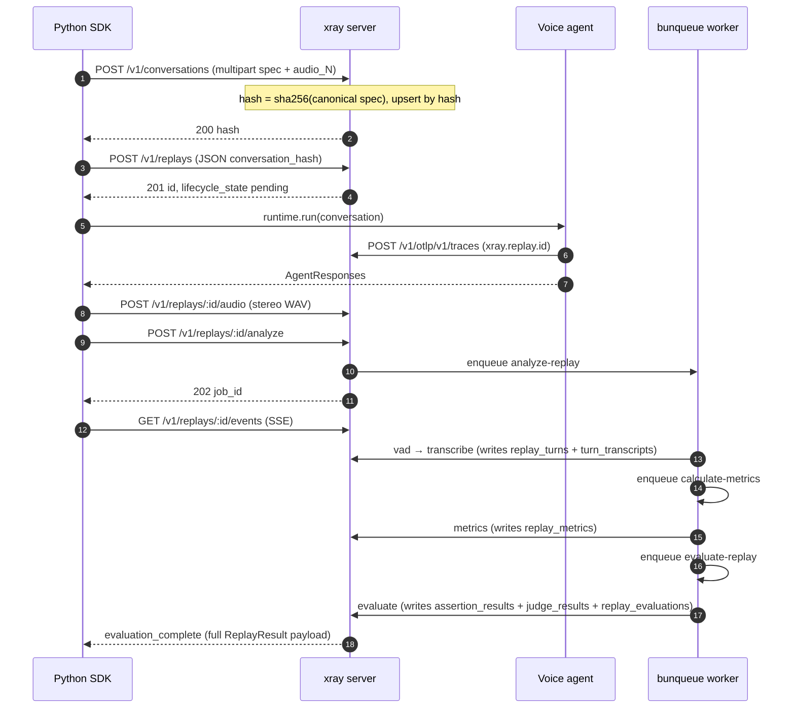

# Integrating xray into an existing LiveKit Agents worker

This is the canonical walkthrough. If you've got a LiveKit Agents
worker today and you want xray to record + replay its conversations,
read top-to-bottom and copy the code blocks.

You'll need:

- xray running. Latest image, mounted volume for `/data`. The
  reference compose snippet is at the bottom of this doc.
- LiveKit server **≥ v1.7** reachable from both the test driver and
  the agent worker (the xray SDK propagates the replay context via
  `participant.attributes`, added in 1.7).
- Python **3.10+** for the agent. The xray SDK runs on the same
  Python you ship your agent on; no version uplift required.

The example below is a real-world voice-service worker; the wiring
is identical for any LiveKit Agents codebase.

## Request flow at a glance

`xray.run(...)` orchestrates the calls below. You don't write any of
them by hand — but this is the sequence to keep in your head when
something fails:



Two surfaces, one trust boundary: the **control plane** (the first
two POSTs + the audio / analyze / events / PATCH calls) is the only
write path that can create rows. The **OTLP receiver** (the agent's
`POST /v1/otlp/v1/traces`) is a *filter*: spans tagged with an
unknown `xray.replay.id` are dropped silently. That's safe precisely
because the replay row exists before the runtime emits its first
span.

---

## 1. Install the SDK on the agent side

```bash
pip install xray-py[livekit]
```

The `[livekit]` extra pulls in `livekit` + `livekit-api`. Drop it if
you implement your own driver class.

Set `XRAY_OTLP_ENDPOINT` on the agent worker:

```bash
export XRAY_OTLP_ENDPOINT=http://xray:8080
```

xray's OTLP receiver accepts both `application/x-protobuf` (the stock
OTel HTTP exporter's default) and `application/json`, so existing OTEL
pipelines work too — `xray.attach` ships an OTLP/JSON exporter
configured to point at xray.

---

## 2. Wrap the worker entrypoint with `xray.attach`

```python
import xray
from livekit.agents import JobContext, WorkerOptions, cli, AutoSubscribe

async def entrypoint(ctx: JobContext) -> None:
    await ctx.connect(auto_subscribe=AutoSubscribe.AUDIO_ONLY)

    async with xray.attach(ctx, service_name="my-agent") as session:
        # `session` is None when no xray-tagged participant joined.
        # Inside the block, OTEL baggage carries:
        #   xray.replay.id, xray.conversation.hash, xray.modality
        # The bundled span processor lifts those onto every span at start.
        # On block exit, the tracer provider force-flushes so spans land
        # in xray before the worker shuts down.

        # Your existing strategy / pipeline runs here:
        await your_agent.run(ctx, session=session)


cli.run_app(WorkerOptions(entrypoint_fnc=entrypoint))
```

Notes:

- `xray.attach` is an **async context manager**, not a decorator.
  Decorator wrappers break LiveKit Agents' multiprocessing
  forkserver pickling (the agent runs each job in a fresh
  subprocess that picks up the entrypoint by `__main__.entrypoint`
  lookup).
- Call `xray.attach` **after** `ctx.connect(...)` — before connect,
  `ctx.room.remote_participants` is empty and the bind has nothing
  to scan.

---

## 3. Emit OTEL spans

xray's OTLP receiver accepts every span the agent worker emits.
Recognized vocabularies (`xray.*`, OTel GenAI `gen_ai.*`, Langfuse
`langfuse.*`) get persisted as raw spans AND extracted into structured
rows where the vocabulary supports it:

- `gen_ai.operation.name = execute_tool` → `tool_calls` row.
- `gen_ai.operation.name = chat` / `text_completion` (and the Langfuse
  `generation` observation) → `model_usage` row.
- `xray.turn` / `xray.stage.stt` / `xray.stage.tts` spans land in the raw
  `spans` table for the inspector's timeline. They carry no structured
  payload — server evaluation runs from the declared `Assertion` /
  `Judge` variants, not from driver-emitted spans.

The full attribute contract is in [`wire-contract.md`](./wire-contract.md).

Spans from unrecognized vocabularies are dropped silently — that's the
"filter, not a gate" design so noisy framework spans don't fill the DB.

Tool calls / model usage from any OTel-instrumented LLM client (the
`opentelemetry-instrumentation-openai-v2` package, Langfuse, etc.)
land in xray automatically. No xray-specific code required.

---

## 4. Write a test

```python
import asyncio
import xray
from xray import Assertion, Judge
from xray.conversation import RecordedAudio
from xray.runtime.livekit import LiveKitRuntime


async def main():
    conv = xray.Conversation(
        name="booking-happy-path",
        turns=[
            xray.Turn.agent(key="a-greeting"),
            xray.Turn.user(
                "Book a table for two at 7pm.",
                key="u-question",
                audio=RecordedAudio(path="/path/to/utterance.wav"),
            ),
            xray.Turn.agent(
                key="a-answer",
                assertions=(
                    Assertion.contains("confirmed"),
                    Assertion.tool_called("reserve_table"),
                    Assertion.tool_args_match("reserve_table", {"party_size": 2}),
                    Assertion.max_latency_ms(2_000),
                ),
            ),
        ],
        judges=(
            Judge.text_match(
                "The agent confirms a reservation for two at 7pm.",
                pass_score=80,
            ),
        ),
    )

    driver = LiveKitRuntime(
        url="ws://localhost:7880",
        api_key="devkey",
        api_secret="devsecret32charsminimumlengthxyz123",
        room=f"booking-test-{__import__('uuid').uuid4().hex[:6]}",
    )

    result = await xray.run(
        conversation=conv,
        runtime=driver,
        xray_url="http://localhost:8080",
        run_config=xray.RunConfig(model="gpt-4o", temperature=0.5),
    )
    print(f"replay: {result.replay_id} passed={result.passed}")
    for a in result.assertions:
        print(f"  turn {a.turn_idx} [{a.kind}]: {a.status} {a.message or ''}")
    for j in result.judges:
        print(f"  judge {j.judge_idx} [{j.kind}]: {j.status} score={j.score} — {j.reason}")


asyncio.run(main())
```

In pytest the same call is one assertion:

```python
async def test_booking_happy_path():
    result = await xray.run(conversation=conv, runtime=driver, xray_url=XRAY_URL)
    assert result.passed, xray.format_failures(result)
```

`xray.run` is async — wrap in `asyncio.run` for sync test harnesses.
There is no sync `xray.run`; the previous one was a footgun in
already-running loops (pytest-asyncio, Jupyter, LiveKit Agents).

What `xray.run` does:

1. POST the Conversation (idempotent upsert; assertions + judges
   are part of the canonical spec the server hashes).
2. POST the Replay row eagerly (`lifecycle_state='pending'`).
3. Bind the driver, attach replay baggage, run the driver — playing
   user audio + capturing agent audio + transcripts.
4. Assemble a 48 kHz int16 **stereo WAV** (L = user, R = agent,
   wall-clock-aligned) and POST it to `/v1/replays/:id/audio`, with the
   `X-Recording-Started-At` header set to the wall-clock (ISO-8601 UTC) of
   audio sample 0. This anchor is the sole origin for mapping span
   timestamps onto the audio timeline — the server derives each tool /
   model / span row's per-turn membership from it. **A custom `Runtime`
   that produces audio MUST report it**: return
   `RuntimeResult.recording_started_at_epoch` (Unix epoch seconds of sample
   0) and `xray.run` sends the header for you. Omit it and span→turn
   attribution is skipped — every `tool_called` / `tool_not_called` /
   `tool_args_match` / `max_ttft_ms` assertion comes back `errored`.
5. POST `/v1/replays/:id/analyze` — server enqueues the three-stage
   analyze chain (`analyze-replay` → `calculate-metrics` →
   `evaluate-replay`).
6. Stream SSE on `/v1/replays/:id/events` until `evaluation_complete`
   (chain finished) or `failed` (chain stopped).
7. Translate the `evaluation_complete` payload into
   `xray.ReplayResult` and return it.

Failure model: assertion failures don't raise — they're outcomes on
`result.assertions`. Infrastructure failures (transcription provider
down, judge LLM unavailable) raise `xray.ReplayEvaluationError`.

User-turn audio formats:

- `RecordedAudio(path=...)` — 48 kHz mono int16 WAV on disk, uploaded
  to xray with the conversation spec.
- `TtsAudio()` (or no `audio` at all) — synthesized **server-side**
  during the conversation upsert, by the provider the xray server is
  configured with (`XRAY_TTS_PROVIDER`: OpenAI / Google / Mistral).
  The generated audio is stored content-addressed and its sha256 is
  part of the conversation hash; the driver pulls the exact bytes back
  before joining the room. No TTS key in the SDK's process.

For Cartesia / 11Labs / Deepgram, synthesize externally and pass the
output as `RecordedAudio` — additional server-side TTS providers are
one file each in `src/server/tts/`.

---

## 5. Read the result

`xray.run(...)` returns `xray.ReplayResult`:

- `passed: bool` — `True` iff every assertion *and* every judge ran to
  a `passed` status. `errored` counts as not-passed.
- `assertions: tuple[AssertionOutcome, ...]` — one entry per declared
  assertion, in the order they appear on each turn. Each carries
  `turn_idx`, `assertion_idx`, `kind`, `status` (`passed`/`failed`/
  `errored`), and `message` (the reason on non-passed).
- `judges: tuple[JudgeOutcome, ...]` — one entry per declared judge.
  Each carries `judge_idx`, `kind`, `status`, the LLM's 0..100
  `score`, and the LLM's natural-language `reason`.
- `metrics: tuple[TurnMetrics, ...]` — per-turn timing computed
  server-side: `agent_response_ms`, `interrupted`. (Model TTFT is a
  per-call attribute on the replay's `model_usage` rows, populated when
  the agent's instrumentation emits
  `gen_ai.response.time_to_first_chunk` — not a per-turn metric.)
- `replay_id` + `conversation_hash` — pointers back to the server-side
  rows for follow-up inspection.

If you need the live audio + turn boundaries the server derived (for a
custom UI, ad-hoc analysis), `GET /v1/replays/:id` carries the full
detail; `GET /v1/replays/:id/result` returns the same `ReplayResult`
payload outside of the SSE stream so late subscribers can fetch it
directly.

---

## 6. Run xray itself

Production-shape compose:

```yaml
services:
  xray:
    image: ghcr.io/xray-eval/xray:latest
    restart: unless-stopped
    ports: ["8080:8080"]
    volumes: ["xray-data:/data"]
    read_only: true
    cap_drop: [ALL]
    security_opt: ["no-new-privileges:true"]
    # Optional: move bunqueue's SQLite file out of /data
    # environment:
    #   BUNQUEUE_DATA_PATH: /data/bunqueue.db

volumes:
  xray-data:
```

xray ships as a single Docker image. Two SQLite files share the
mounted volume:

- `/data/xray.db` — conversations, replays, replay_turns,
  speech_segments, spans, tool_calls, model_usage, turn_transcripts,
  replay_metrics, assertion_results, judge_results, replay_evaluations,
  tts_synth_cache (13 tables; see [`architecture.md`](./architecture.md)).
- `/data/bunqueue.db` — bunqueue's job queue + DLQ (the
  `analyze-replay` worker runs embedded in the same Bun process).

Inspector UI at `http://localhost:8080`.

---

## What changed from earlier alphas

This release moves assertion + judge evaluation onto the server.

- **Declarative assertions + judges.** Replace per-turn lambdas with
  `Assertion.contains(...)`, `Assertion.tool_called(...)`,
  `Assertion.max_latency_ms(...)`, etc. Replace per-replay judge
  callables with `Judge.text_match(reference, pass_score=...)`. Both
  ship on the wire and run server-side — every SDK (Python today,
  others tomorrow) speaks the same shape.
- **`xray.run(...)` returns `ReplayResult`** with `passed` + per-
  assertion / per-judge / per-turn-metrics. Assertion failures don't
  raise — `assert result.passed, format_failures(result)` is the
  pytest idiom. Only infrastructure failures (transcription provider
  down, judge crashing) raise `ReplayEvaluationError`.
- **Three-stage server chain.** `/analyze` now enqueues
  `analyze-replay` (VAD + per-turn Whisper transcription), which
  enqueues `calculate-metrics` (agent_response_ms, interrupted), which
  enqueues `evaluate-replay` (runs all assertions + judges, emits
  `evaluation_complete` SSE).
- **SSE event renamed.** The `completed` event is gone; the chain
  emits `evaluation_complete` with the full `ReplayResult` payload.
- **`GET /v1/replays/:id/result`** — fetches the same payload outside
  the SSE stream for late subscribers.
- **Server requires a provider key** at runtime (`OPENAI_API_KEY`,
  `GOOGLE_API_KEY`, or `MISTRAL_API_KEY`) for TTS + transcription +
  judge calls. Per-stage overrides: `XRAY_TTS_PROVIDER` /
  `XRAY_TRANSCRIPTION_PROVIDER` / `XRAY_JUDGE_PROVIDER`, plus
  `XRAY_TTS_MODEL` / `XRAY_TTS_VOICE` / `XRAY_TRANSCRIPTION_MODEL` /
  `XRAY_JUDGE_MODEL`.
- **No more SDK-side enrichment fetch / final PATCH.** The SDK only
  PATCHes when the driver itself fails (mixdown error, missing audio
  file).
- **Schema reset.** If you're upgrading an existing volume, drop
  `xray.db` and `bunqueue.db` before starting the new container —
  the column shape of `replays` + the new `turn_transcripts` /
  `replay_metrics` / `assertion_results` / `judge_results` /
  `replay_evaluations` tables aren't migration-compatible.
